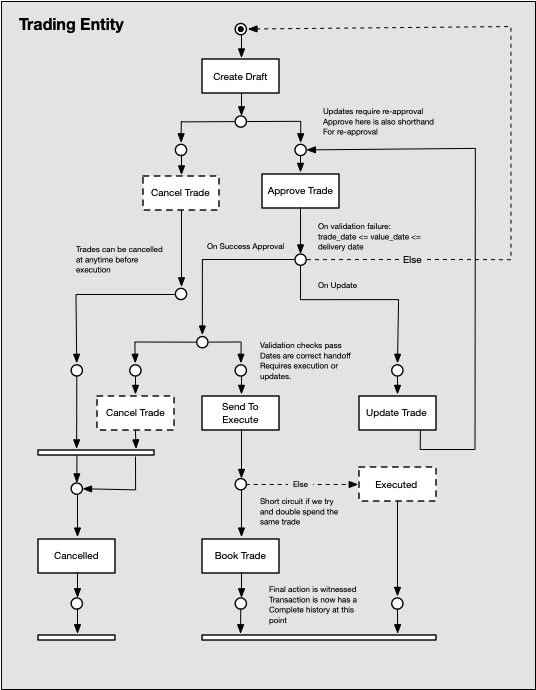

# Trade Approval System

A functional, content-addressable trade approval system for financial transactions built with Rust.

## Overview

This system manages the lifecycle of forward contract trades through an approval workflow. Rather than mutating database records, it treats all data as immutable, content-addressed objects. Trade state is derived by replaying an append-only witness chain.

**Key Features:**
- **Immutable by design** - all data is content-addressed and tamper-evident
- **Complete audit trail** - append-only witness chain records every action
- **Derived state** - no stored state, computed from witness history
- **Re-approval workflow** - updates invalidate previous approvals
- **Pure functional core** - state derivation logic has zero I/O dependencies

## Quick Start

### Prerequisites

**Using Nix + devenv (recommended):**

Nix provides deterministic builds and reproducible environments. It ensures:
- **Reproducibility** - everyone on the team uses identical tool versions
- **Isolation** - project dependencies don't conflict with your system
- **Declarative setup** - environment defined in code, not manual installation steps
- **Cross-platform consistency** - same environment on macOS, Linux, and CI/CD

Without Nix, environments remain heterogeneous, leading to "works on my machine" issues.

Install these tools:
- [Nix installer](https://determinate.systems/nix-installer/)
- [devenv](https://devenv.sh/getting-started/)
- [direnv](https://direnv.net/)

**Or install Rust directly:**
- [rustup](https://rustup.rs/)

### Build & Test

```bash
# Build the project
cargo build

# Run tests
cargo test

# Generate documentation
cargo doc --open
```

## Trade Lifecycle

The trade lifecycle is modeled as a Petri net, shown below:



### How to Read a Petri Net

A Petri net is a mathematical model for representing concurrent systems and workflows:

**Basic Elements:**
- **Circles (Places)** = States or conditions (e.g., `Draft`, `PendingApproval`, `Approved`)
- **Rectangles (Transitions)** = Actions or events (e.g., `Submit`, `Approve`, `Update`)
- **Arrows (Arcs)** = Flow connections showing which states enable which actions
- **Tokens (dots inside circles)** = Current position(s) in the workflow

**Reading the Flow:**
1. **Enabled Transitions** - A transition can fire when all its input places contain tokens
2. **Firing** - When a transition fires, it consumes tokens from input places and produces tokens in output places
3. **No-Operation (thin rectangles)** = Synchronization points that consume tokens from parallel branches

**In this system:**
- Each transition creates an immutable witness appended to the chain
- Tokens represent the current state derived from the witness history
- The Petri net formally guarantees valid state transitions

See the [full documentation](#documentation) for detailed explanation of the state machine and witness types.

## Usage Example

```rust
use trade_approval::service::TradeService;
use trade_approval::trade::{TradeDetails, Currency, Direction, TimeStamp};
use std::sync::Arc;

// Initialize the service with sled database
let db = Arc::new(sled::open("trade_db")?);
let service = TradeService::new(db);

// 1. Build trade details using the builder pattern
let trade_details = TradeDetails::new()
    .new_trade_entity("entity_abc")
    .new_counter_party("counterparty_xyz")
    .set_direction(Direction::Buy)
    .set_notional_currency(Currency::USD)
    .set_notional_amount(1_000_000)
    .set_underlying_currency(Currency::EUR)
    .set_underlying_amount(850_000)
    .set_trade_date(TimeStamp::new())
    .set_value_date(TimeStamp::new())
    .set_delivery_date(TimeStamp::new());

// 2. Submit trade for approval (creates Submit witness → PendingApproval)
let trade_ctx = service.submit_trade(
    trade_details,
    "requester_user123".to_string(),
    "approver_user456".to_string(),
    "user_addr_123".to_string(),
)?;

println!("Trade submitted: {}", trade_ctx.trade_id);
println!("Current state: {:?}", trade_ctx.current_state()); // PendingApproval

// 3. Approve the trade (creates Approve witness → Approved)
let approved_ctx = service.approve_trade(
    trade_ctx.trade_id.clone(),
    "approver_user456".to_string(),
)?;

println!("Current state: {:?}", approved_ctx.current_state()); // Approved
```

## Documentation

**For comprehensive documentation, architecture details, and complete examples, please refer to the Rust documentation:**

```bash
cargo doc --open
```

The documentation includes:
- Detailed architecture and design philosophy
- Complete witness type specifications
- State machine mechanics and derivation logic
- Full workflow examples (basic approval, re-approval, cancellation)
- Content-addressable storage strategy
- API reference for all modules
